<h1 align="center">Katapult Fielding Manual</h1>

# Mobile Interface
Field collection in Katapult Pro is centered around photo documentation and the mobile interface. To access it, open Google Chrome on your device and go to katapultpro.com/mobile. (Safari can work on iOS devices as well, though we recommend using Chrome.)

After signing in, you will see that the mobile interface revolves around the dropper in the middle of the screen. You can pan the map to position the dropper, and pinch to zoom in and out.

At the top of the screen, you can view your mobile hamburger menu on the left. Click on it to open the menu, then click "Toolset” to change the active tools that appear when you click the dropper. The menu should feel similar to the desktop interface, with a few small exceptions. If you select “Manage Offline Jobs,” you will have the option to cache job data for **offline use**. While you have an Internet connection, be sure to add to this list which job(s) you'd like to collect for offline.

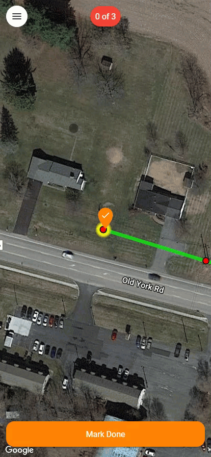

Then, when you're working offline, you click the three-dot menu to download any offline data in the event of any issues re-syncing with the database.

Earlier in the menu, underneath the Toolsets, you'll find "Map Layers" (if the job has any map layers). The toggles to the left of the layer name will allow you to toggle the visuals of the layer on and off. If there are API layers available in the Map Layers of your selected job that are grouped, you'll be able to expand/collapse those groupings in this menu (as seen in the screenshot below).

Under settings, there are many helpful options that may assist in field collection, such as:
- Auto-Zoom Checklist - Moves dropper to the next design feature after marking “done”
- Center Map On GPS - Keeps panning the map to always be centered on your location, great for vehicle collection in which a navigator needs to follow along with the design

# Data Collection
The fielding crew will roughly follow the photo documentation outlined in the flow chart

## step 1: take Sync Shot

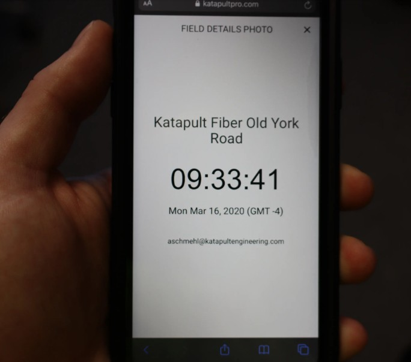

Take a photo of the sync shot screen with any and all cameras being used to collect data. These photos will allow the software to recognize the offset between camera photos and the actual time, associating all photos to the correct locations.

## Step 2: Collecting Midspan Data

### Big Camera (or Main Camera) Operator's responsibilities:
- **Confirm Design** - Use the mobile field tools to draw, move, and edit nodes, references, and connections to match existing conditions.
  
- **Take Midspan Height Photo** - Once your crewmate has the height stick in position, take a photo with the base of the stick up to the highest conductor in frame.

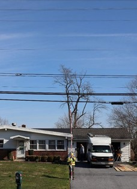

- ***TAKE THE SHOT PERPENDICULAR TO THE MIDSPAN*** - It is imperative that the main camera operator is perpendicular to the midspan. Other angles may introduce a “lean” to the wires, which could drastically amplify any errors.
  
- **Mark "Done (Midpoint)"** - Once all photos have been taken, the Main Camera Operator will use the phone to indicate that the midspan measurement photo has been captured. Because the location of midspan measurements has an implication on make ready engineering, users can choose to place midspan sections at either the midpoint in the connection or over a critical crossing. *If the fielders are unsure of the best location for areas with critical crossings, it is okay to capture more midspans, it is always better to have more than not enough to avoid having to go back out*.

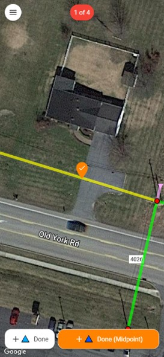

### Height Stick Operator's responsiblities:

- **Safety** - Be mindful and careful of road crossings and traffic when collecting midspan data. Lower the height stick from the top section down (as needed) to avoid coming into contact with conductors.

- **Holding the height stick** - Make sure the height stick is facing the proper way and as straight as possible. Ensure that as many calibration points are visible as possible. ***Hold the height stick directly underneath the overhead cables***. If you're not directly underneath the cables, the collected data will be inaccurate.

- **Communication** - Make sure to communicate with your partner to ensure they know which overhead lines you are standing underneath so they can mark the correct span "done."

## Step 3: Collect Pole Data

>It is critical to follow Katapult's Height Photo Best Practices during this process. 
>>Pole height Photo Best Practices:
>>>- The height stick must be straight and flat against the pole - **If the fielder’s hand is between the pole and the height stick, there is at least a hand’s-depth of space, maybe more**. If the fielder’s hand is on the outside of the height stick pressing it against the pole, it is more likely there is no space between the height stick and the pole.
>>>- **Stand at approximately a 45 degree angle from the pole** - This angle is best to capture any bisecting down guys (as well as any equipment that may otherwise be obstructed by any crossarms) to provide the most visibility of the pole’s attachments for those working in the back office.
>>>> 

>>>> 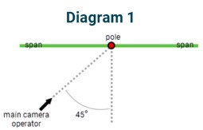
>>>> 

>>>- Stand at least a pole’s length away when taking the photo - Standing too close to the pole will introduce parallax, which will make taking an inaccurate photo more likely.
>>>- Frame the photo so there is sky above and ground below the pole - Ensuring proper framing around the pole not only reduces parallax, but it also provides additional environmental context for the back office to understand what is surrounding the pole (reference below).
>>>> 

>>>> 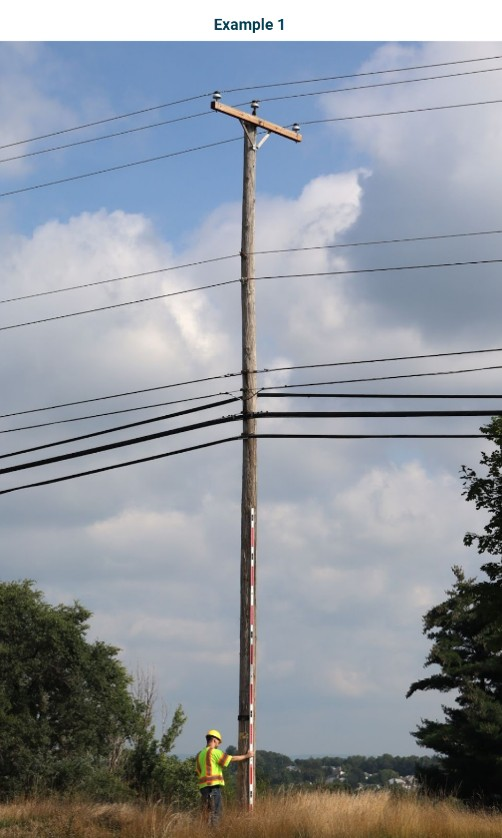

### Main Camera Operator's responsibilities

- **Confirm Design** - Use mobile tools to ensure that the job design matches existing conditions.

- **Hallway Photos** - Take full frame photos in landscape orientation of your subject pole and the other poles it is connected to. These photos can often be taken at the previous and next midspan positions to start and end each pole's collection set. These photos are taken for context and are often used to assist in back-office processing.

- **Pole Height Photo** - Once your Height Stick Operator is in position, take a portrait orientation photo of the pole at about 45 degrees from whichever side has the best lighting and visibility of equipment such as power risers that may need to be measured for make ready engineering. **Make sure you are standing the pole height's distance away from the pole** (If the pole is 40', stand 40' away from the pole). If you stand any closer than that, you run the risk of introducing the issue of parallax and may produce bad data.

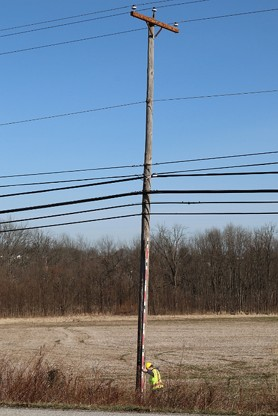

- **Side Photo** - photos are context photos taken in portrait orientation that are zoomed in profiles of the pole from the lowest communication attachment up to the top of the pole. We take this photo from both sides to ensure that our engineers have the necessary context to make good make ready engineering decisions.

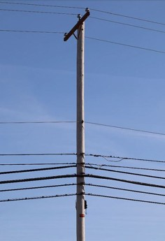

- **Communications Identification** - Also take zoomed in photos of comm wraps to identify attachers present on poles. Zoom in on one cable tag at a time, and focus the camera. Take picture from backside also if you can see any text on the other side of the tag. If there are no comm tags with visible names or phone numbers please look for IDs on any Risers, Pedastals, HHs, Etc.

- **Transformer Size** - This is a shot of the transformer to help identify the size of the transformer. This shot is only needed if you can see the number on the transformer and will be used in pole loading workflows.

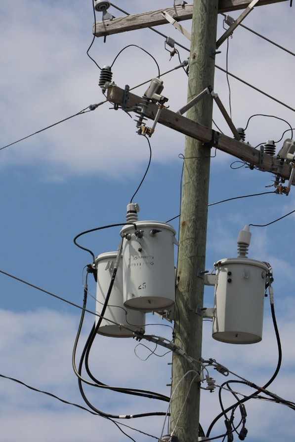

### Height Stick Operator responsibilities
- **Holding the height stick** - The most important photo taken at the pole is typically the height photo, which means the Height Stick Operator's first priority is typically holding the height stick in an optimal position for the Main Camera Operator to get a clear height photo. Make sure the height stick is flush against the pole and that it follows the natural lean of the pole, if applicable.
  
  >**There should be no space between the height stick and the pole as you hold it up against the pole**. If you leave space, this could adversely affect your height measurements. Be sure to keep all calibration targets visible and alert your partner of risers or other equipment that may require taking your height photo from a different angle.

- **Pole Tag Photo** - Use the small camera to document any and all pole identification numbers found on the pole. If there are none, **use the "NO TAG" sticker** on the back of the height stick to let your office staff know that none was found.

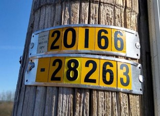

- **Birthmark Photo** - Use the small camera to document the pole's height, class, species, and year, if applicable. **If this information cannot be found or is illegible, capture a photo of a groundline circumference measurement (***where the pole meets the ground***) and a photo of the "NO BIRTHMARK" sticker on the back of the height stick**.

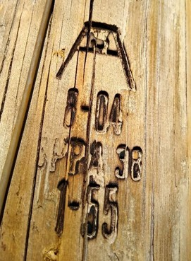

- **Grounding Photos** - These photos are taken to indicate grounding information found at the base of the pole. Typically this is to indicate either the existence of grounding or a cut ground wire.

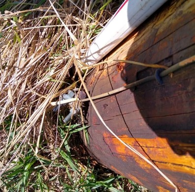

- **Back Photo** - This photo is taken with the small camera from a third angle that provides context for back-office processing, especially with risers and other equipment. *Taking a second Side Photo with the main camera can replace this shot*.

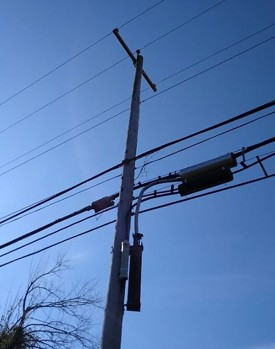

- **Anchor Hallway** - A photo taken with the pole in the picture looking towards the anchor and down guys. You want to frame the photo to see the base of the pole and the down guys to the anchor(s). Be sure to capture space on the down guys above the guy guards and include the stick or measuring device in the photo.

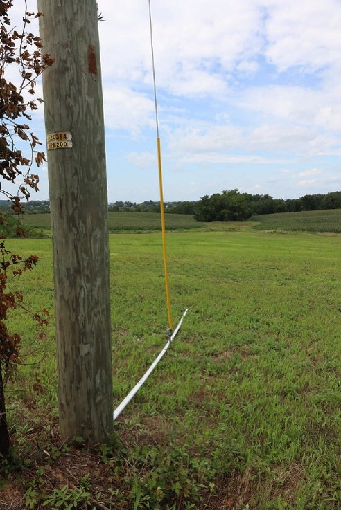

- **Anchor** - A picture of the anchor when one is present is useful to verify anchor details. Be sure to capture the rod and eyes in the photo. It is useful to see the lead length measurement in this photo as well.

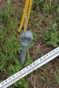

## Step 3.1: Collecting Anchor & Downguy Information
>**[Click here to watch katapult's video on collecting Anchor & Downguys](https://www.youtube.com/watch?v=M5HJFqtu2sc&list=PLGet9Wz8csitdW64z-tVW1XrlWyXhS_pP&index=6)**

Entering anchor information is a critical portion of the Katapult Pro fielding process.

- Use the Anchor tool to add them to your design.

- After entering the distance from the pole (we typically use the height stick or a laser for this measurement), use either the bisect or inline buttons underneath the distance and bearing to snap the anchor into the proper location.

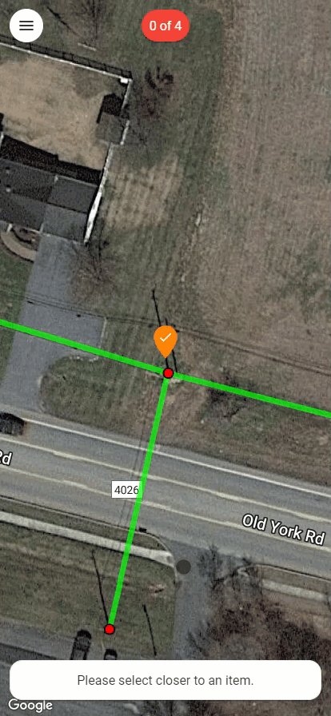

- After confirming the design, the software will prompt you through a step-by-step form to enter information such as rod size, number of eyes, strand sizes, auxiliary eyes, and anchor elevation.

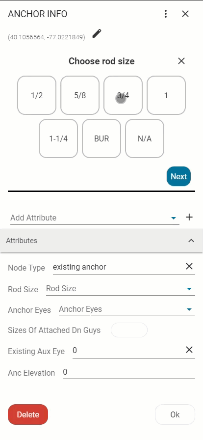

Later, during the back-office process, this information will be linked to the down guy height of attachments to be used in pole loading analysis.

At the bottom of the screen, you’ll see the distance and bearing for the dropper, and you can either move it to the correct position by clicking on a new location or type in the distance or bearing. Once you click on a location, this will move the anchor to the new location you have selected. If you wish to cancel this action and not move the anchor, you can click on the "X" in the “MOVE ANCHOR” modal at the bottom of the screen.

**Once all pole photos have been taken and Anchor information collected, the Main Camera Operator will mark the pole "Mark Done" and continue moving forward throughout the job.**

# Uploading Photos

- When the field crew gets back to the office, hotel, or their home, the next step in the process is to upload all field photos. We recommend offloading all photos to an external drive under a folder indicating the date and crew members' initials who collected the data. This way, if the upload gets interrupted, you still have a repository of all your fielded photos.
>**DO NOT upload photos into Cloud-based Collaboration and Document Management Systems, such as Microsoft SharePoint. These can corrupt photo .EXIF data.**

>Be mindful if you're using a Canon camera; the cameras keep sequential count of the images, starting at IMG_0001. When the camera hits IMG_9999, it creates an entirely new folder. This happens once every 10,000 images, so make sure to look for that additional folder of photos to upload before formatting the card.

- Next, go to *katapultpro.com/upload* (or choose "Upload" from the App Tray) and select the number of cameras' photos being uploaded.

- Drag and drop the photos you would like to upload, and then press the next arrow in the bottom right. Then, choose whether to select the sync photos automatically or manually. The system will take some time to scan through photos and find the sync photos if you choose for them to be selected automatically.

- Once a sync shot is found or selected, enter the field details exactly as they appear in the sync photo. You may receive a warning that photos will not associate correctly, which typically means that the sync info was entered incorrectly.

- Once you have finished entering sync information, you can continue uploading your photos. Towards the end of the upload, you'll have options to notify project managers, notify remote processors, and associate photos on upload. (Katapult recommends associating after classifying photos, which happens after uploading them.)

- **Make sure that you keep the tab running with consistent Internet connection while your photos upload! Otherwise they might look completely gray with an "Error" text on it and will need to be re-uploaded**. Once the photos have been successfully uploaded, back-office processing can begin.

# Mobile-Only Tools
You can access your mobile toolset at any time by clicking/touching the dropper in the center of the screen. There are a few tools that are specific to mobile that will be necessary for data collection in the field.

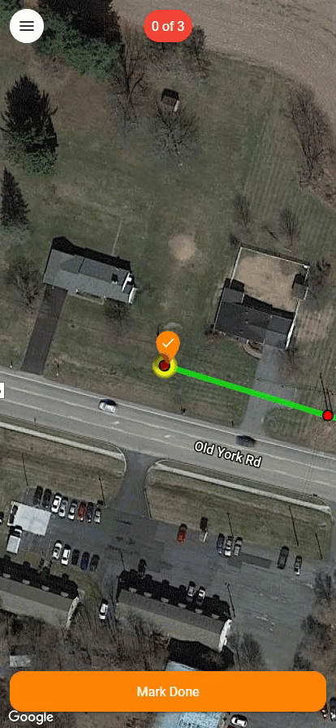

### Navigation Tool 

The navigation tool allows users to select a location from Katapult Maps and spawn a Google Maps navigation session that will direct the user to their design.

### Sync Photo Tool

The sync photo tool allows multiple cameras to be synchronized with the Katapult Pro database.

The sync photo screen (screenshot below) will pop up when you first open a job, or you can manually open it with the Sync Photo tool in the mobile toolset. Take a photo of this screen with all cameras being used for data collection whenever:
- Crew starts a new job
- You change users or phones to interact with the design
- Your crew starts a new day of collection
- You change cameras
  

>**When you upload your photos at the end of the day, you will enter the information from these sync photos to automatically associate your photos. Make sure the time, date, time zone, and user are correct to ensure proper association.**

### Checklist
The most important tool in mobile is your checklist.

This tool is typically automatically equipped after taking the sync shot, but should you ever need to manually equip the tool, you can find the tool in the mobile toolset by clicking on the dropper and choosing "Checklist."

The checklist tool allows you to indicate when your crew is finished taking photos of a design element, effectively "checking" it off the list of elements that need photos. Marking elements as 'Done' places an attribute on the node or section, called a time bucket, allowing photo association back in the office.

### Undo Time

You can also use the Undo Time tool to remove the last time bucket that you placed. This tool should only be used by advanced field technicians.
